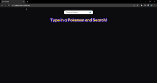
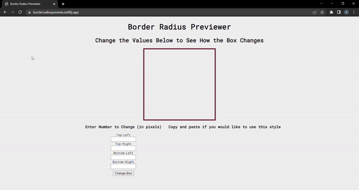
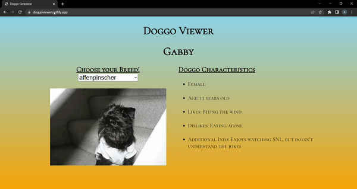

### Hi there 👋, Alex Liebhaber

#### Software Engineer passionate about creating and learning.

Hey, I'm Alex. I'm a Software Engineer, with a background in Psychology and Management. I am motivated by making projects that push my skills and knowledge.

See my website for more! https://alexliebhaber.netlify.app/

- I’m currently working on My Budgeting App and Machine Learning with JS
- Committed to committing code every day of 2022!

<h3> 🤝🏻 &nbsp;Connect with Me </h3>

<h3> 🛠 &nbsp;Tech Stack</h3>

- 🌐 &nbsp;
  
  
  
  
  
  
- 🛢 &nbsp;
  
- ⚙️ &nbsp;
  
  
- 💻 &nbsp;
  

 

<table bordercolor="#a3496a">
  <!-- Row 1 -->
  <tr>
    <td width="50%" valign="top">
      <h3 align="center">Bariste Coffee</h3>
         
        
         
        

          
   
  
        

         
<strong>Web Site - JS, HTML, CSS, SCSS</strong>

    </td>
    <td width="50%" valign="top">
      <h3 align="center">Poke-Pics</h3>
       
        
       
        

   
  </a>
  
  </a>
      

        
<strong>Web App to Look Up Any Pokemon Using Pokemon API - JS, HTML, CSS</strong>

    </td>
  </tr>
<!-- Row 2 -->
  <tr>
    <td width="50%" valign="top">
      <h3 align="center">Border Radius Previewer</h3>
         
        
         
        

          
   
  
        

         
<strong>Web App to Preview and Create Custom Border Radius - JS, HTML, CSS</strong>

    </td>
    <td width="50%" valign="top">
      <h3 align="center">Doggo Viewer</h3>
       
        
       
        

   
  </a>
  
  </a>
      

        
<strong>Web App to View Several Breeds of Dogs Using Dog API - HTML, CSS</strong>

    </td>
  </tr>
</table>

